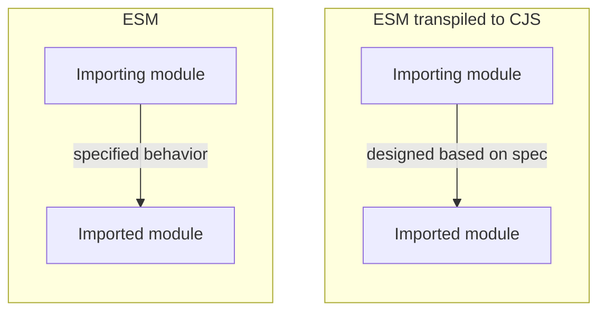
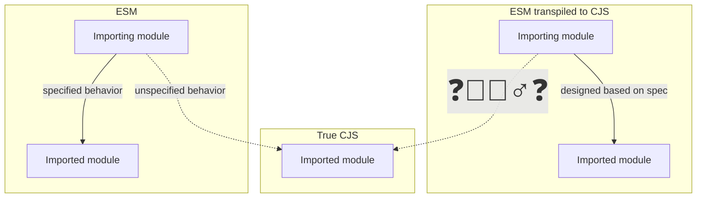

# esm-cjs-interop

```mermaid
graph TB
  subgraph Transpiled[ESM transpiled to CJS]
    direction TB
    C[Importing module] -- designed based on spec --> D[Imported module]
  end
  subgraph ESM
    direction TB
    A[Importing module] -- specified behavior --> B[Imported module]
  end
```

```mermaid
graph TD
  subgraph Transpiled[ESM transpiled to CJS]
    C[Importing module] -- designed based on spec --> D[Imported module]
  end
  subgraph CJS[True CJS]
    E[Imported module]
  end
  subgraph ESM
    A[Importing module] -- specified behavior --> B[Imported module]
  end
  A -. unspecified behavior .-> E
  C .->|"<span style='font-size: 3em'>❓🤷🏻‍♂️❓</span>"| E
```
