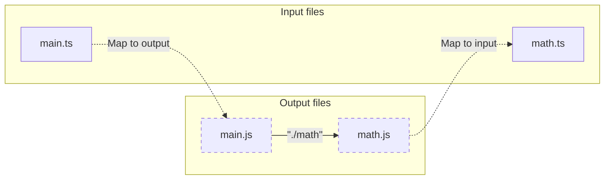
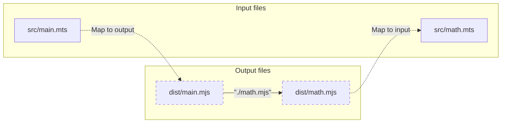
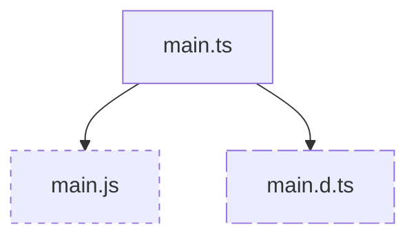

# theory

```mermaid
graph LR
  main.ts -- "#quot;./math#quot;" --> math.ts
```

```mermaid
graph LR
  subgraph Output files
    main.js
    style main.js stroke-dasharray: 5 5
    math.js
    style math.js stroke-dasharray: 5 5
  end
  subgraph Input files
    main.ts
    math.ts
  end
  main.ts -. Map to output .-> main.js
  main.js -- "#quot;./math#quot;" --> math.js
  math.js -. Map to input .-> math.ts
```

```mermaid
graph LR
  subgraph Output files
    dist/main.mjs
    style dist/main.mjs stroke-dasharray: 5 5
    dist/math.mjs
    style dist/math.mjs stroke-dasharray: 5 5
  end
  subgraph Input files
    src/main.mts
    src/math.mts
  end
  src/main.mts -. Map to output .-> dist/main.mjs
  dist/main.mjs -- "#quot;./math.mjs#quot;" --> dist/math.mjs
  dist/math.mjs -. Map to input .-> src/math.mts
```

```mermaid
graph TB
  main.ts --> main.js
  main.ts --> main.d.ts
  style main.js stroke-dasharray: 5 5
  style main.d.ts stroke-dasharray: 15 4
```
